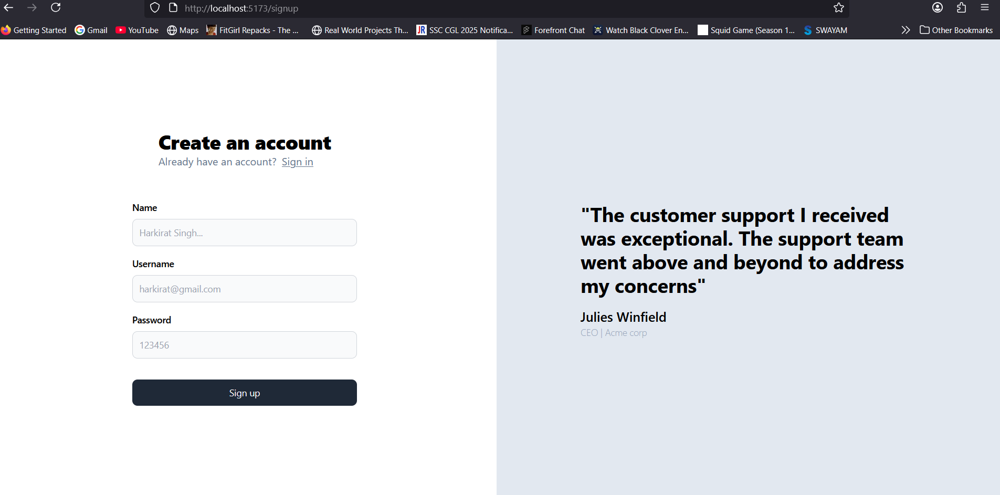
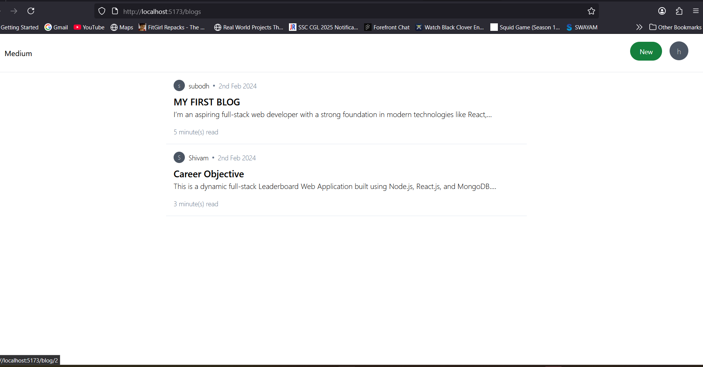
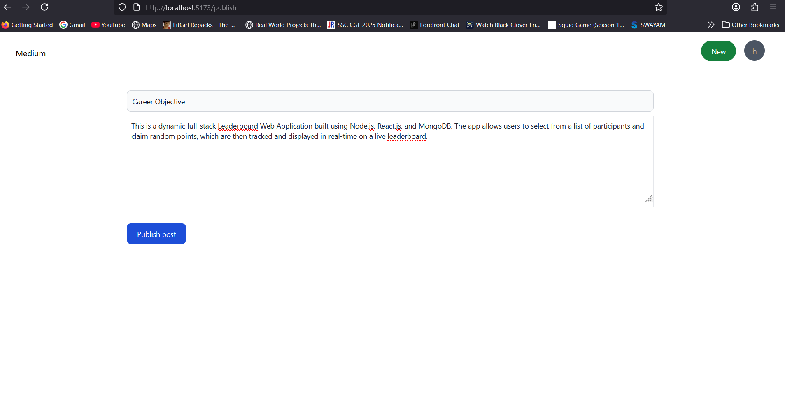

# 🧠 Think-Space

**Think-Space** is a modern, Medium-style blogging platform built using **Next.js**, **Tailwind CSS**, and **MongoDB**. It’s designed for writers, developers, and creators who want a clean space to share ideas, stories, and knowledge.

---

## 🚀 Features

- 📝 Create, edit, and delete blog posts
- 👤 User registration and login
- 📄 Rich text editor for writing content
- 📚 View all blogs and individual posts
- 🎯 Clean, responsive UI using Tailwind CSS
- 🔐 Secure authentication with JWT
- 💾 Postgrees for data storage

---

## 🖼️ Screenshots

### 🔐 Sign Up Page


### 📚 Blogs List Page


### 📖 Single Blog View


### ✍️ Publish Blog Page


---

## 🛠️ Tech Stack

**Frontend**:
- Next.js
- React
- Tailwind CSS
- React Hook Form or Formik
- Markdown or Quill Editor

**Backend**:
- Node.js + Express.js
- postgress SQL
- JWT Authentication
- RESTful APIs

---

## 📦 Getting Started

### 1. Clone the repository

```bash
git clone [https://github.com/yourusername/think-space](https://github.com/SubodhYadao/Think-Space).git
cd Think-Space
